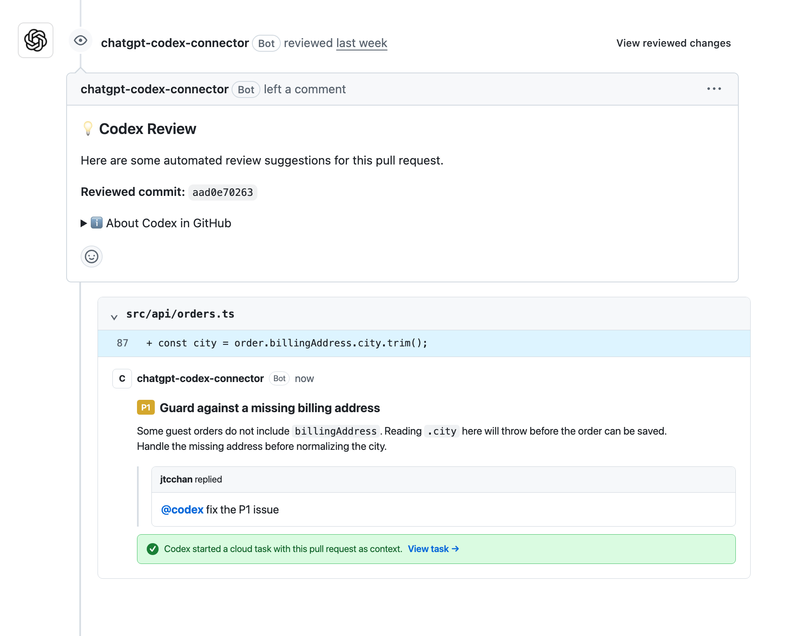

<p align="center">
  
</p>

# Codex Cloud Ready

Prepare a repository for GitHub `@codex` fixes.

## What it solves

Codex can review a pull request automatically. If it finds a problem, reply to
that review finding:

```text
@codex fix the P1 issue
```

Codex starts a cloud task with the pull request as context and can push a fix
back to the branch when it has permission.

That cloud task still needs to know how to install the project and run its
checks. This plugin adds those instructions to the repository.



<sub>Illustrative example based on the Codex review interface in GitHub. The interface may change.</sub>

## Install

### Point your agent here

Give a Codex agent this prompt:

```text
Read https://github.com/jtcchan/codex-cloud-ready and follow its README to
install the plugin. Start a new task after installation. Then use
$setup-codex-cloud in the current repository, show me the generated diff, and
run $verify-codex-cloud. Do not put secret values in the repository or change
account permissions.
```

### Install manually

```bash
codex plugin marketplace add jtcchan/codex-cloud-ready
codex plugin add codex-cloud-ready@codex-cloud-ready
```

Start a new Codex task inside any repository, then say:

```text
Use $setup-codex-cloud to prepare this repository for @codex PR fixes.
```

## What it adds

- `$setup-codex-cloud` reads the project's lockfiles and test scripts, then
  creates repeatable setup and maintenance scripts plus a value-free cloud
  environment contract.
- `$verify-codex-cloud` checks the generated setup without changing it.
- Lockfile support for Node, Python, Ruby, Rust, Go, and PHP projects.
- A small `AGENTS.md` section with the project's setup and test commands.
- Secret-safe repository files: credential values remain in hosted settings;
  the repository records only environment-variable and secret names.

It does not enable automatic review, create a hosted environment, store secret
values, or change GitHub permissions.

## Set up a repository

1. Run `$setup-codex-cloud` in the repository.
2. Review and commit the generated files.
3. Fill in the generated cloud contract file with the verified environment name,
   repository, branch, network policy, and names of required variables/secrets.
4. Rerun the setup command with `--apply`, then run verification so the derived
   manifest matches the contract.
5. Create or select the matching repository's Codex Cloud environment.
6. Put any secret values in the hosted environment, not in Git. Secrets are
   available to setup only, not to the agent phase.
7. Allow the Codex GitHub app to write to the repository if you want fixes
   pushed back to the pull request.

Run the setup again only when the project's install or test process changes.

### Files added

```text
.codex/cloud/setup.sh
.codex/cloud/maintenance.sh
.codex/cloud/environment.json
.codex/cloud/contract.json
AGENTS.md
```

## Official Codex documentation

- [Codex code review in GitHub](https://learn.chatgpt.com/docs/third-party/github)
- [Codex Cloud environments](https://learn.chatgpt.com/docs/environments/cloud-environment)
- [Open Codex environment settings](https://chatgpt.com/codex/settings/environments)
- [Open Codex code review settings](https://chatgpt.com/codex/settings/code-review)

## Development

```bash
python3 -m unittest discover -s plugins/codex-cloud-ready/tests -v
python3 ~/.codex/skills/.system/skill-creator/scripts/quick_validate.py \
  plugins/codex-cloud-ready/skills/setup-codex-cloud
python3 ~/.codex/skills/.system/skill-creator/scripts/quick_validate.py \
  plugins/codex-cloud-ready/skills/verify-codex-cloud
python3 ~/.codex/skills/.system/plugin-creator/scripts/validate_plugin.py \
  plugins/codex-cloud-ready
```

## License

[MIT](LICENSE)
