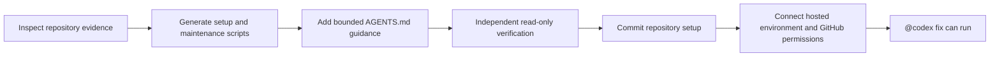

<p align="center">
  
</p>

# Codex Cloud Ready

An open-source Codex plugin that prepares repositories so GitHub `@codex fix`
tasks can bootstrap predictably in Codex Cloud.

## Install

### Point your agent here

Give a Codex agent this prompt:

```text
Read https://github.com/jtcchan/codex-cloud-ready and follow its README to
install the plugin. Start a new task after installation, then use
$setup-codex-cloud to prepare the current repository for GitHub @codex fix
tasks. Show me the generated diff and run $verify-codex-cloud. Never put secret
values in the repository and stop before account-level permission changes.
```

### Install manually

```bash
codex plugin marketplace add jtcchan/codex-cloud-ready
codex plugin add codex-cloud-ready@codex-cloud-ready
```

Start a new Codex task inside any repository, then say:

```text
Use $setup-codex-cloud to prepare this repository for @codex PR fixes.
```

## What happens



## What it provides

- `$setup-codex-cloud` detects repository evidence and generates idempotent
  setup and maintenance scripts.
- `$verify-codex-cloud` independently checks the generated contract without
  repairing failures.
- Locked install support for Node, Python, Ruby, Rust, Go, and PHP projects.
- A bounded `AGENTS.md` section containing detected bootstrap and validation
  commands.
- Secret-safe repository files: credential values remain in hosted settings.

## Repository output

```text
.codex/cloud/setup.sh
.codex/cloud/maintenance.sh
.codex/cloud/environment.json
AGENTS.md
```

The plugin prepares repository-owned configuration. It cannot create the hosted
Codex environment, provide secret values, or grant the GitHub app write access.

## Finish hosted setup

After the generated repository files pass verification:

1. Create or select the repository's environment in Codex Cloud settings.
2. Use the universal image unless the repository needs a custom container.
3. Store credential values in hosted secrets, never in Git.
4. Grant the Codex GitHub app write access to the repository.
5. Commit the generated files, then use `@codex fix` on an actionable review
   finding.

## Development

```bash
python3 -m unittest discover -s plugins/codex-cloud-ready/tests -v
python3 ~/.codex/skills/.system/skill-creator/scripts/quick_validate.py \
  plugins/codex-cloud-ready/skills/setup-codex-cloud
python3 ~/.codex/skills/.system/skill-creator/scripts/quick_validate.py \
  plugins/codex-cloud-ready/skills/verify-codex-cloud
python3 ~/.codex/skills/.system/plugin-creator/scripts/validate_plugin.py \
  plugins/codex-cloud-ready
```

## License

[MIT](LICENSE)
