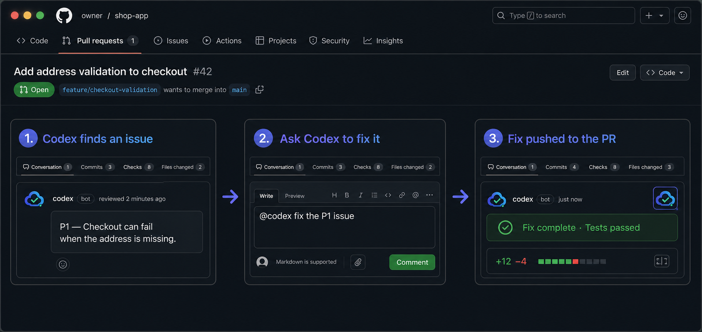
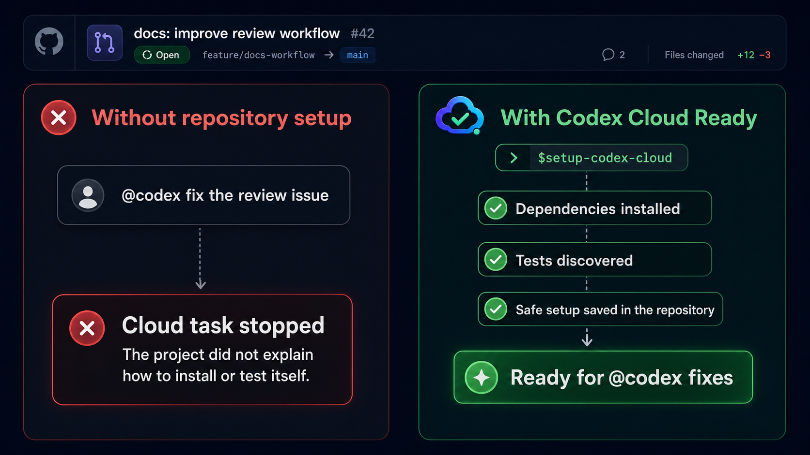
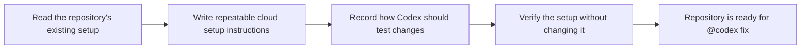

<p align="center">
  
</p>

# Codex Cloud Ready

Turn a Codex review comment into a tested fix on the same GitHub pull request.

Codex can automatically review every pull request and point out serious
problems. Finding the problem is only half the job, though. When someone replies
with `@codex fix`, Codex Cloud still needs to know how to open that repository,
install its dependencies, and run its tests.

Codex Cloud Ready writes those instructions into the repository once, so the
fix can happen where the review already lives.



<sub>Illustrative mockup. The exact GitHub and Codex interface may change.</sub>

## The problem it solves

Think of automatic review as a teammate who spots a problem and leaves a note.
`@codex fix` asks that teammate to repair it. But Codex cannot safely repair the
project if a fresh cloud workspace does not know how the project is installed
or tested.

Without repository setup, a cloud task may stop before it reaches the actual
fix. This plugin gives the repository a small, version-controlled setup guide:

- how to install the project's locked dependencies;
- how to refresh them when a cached cloud workspace resumes;
- which checks prove that a change is safe;
- which instructions Codex should follow for this repository.



<sub>Illustrative mockup. No secrets or account permissions are stored in these repository files.</sub>

## A normal workflow

1. Install this plugin once on the computer where you use Codex.
2. Run `$setup-codex-cloud` once in each repository you want to prepare.
3. Review and commit the generated setup files.
4. Connect that repository to a Codex Cloud environment and allow the Codex
   GitHub app to write to it.
5. When Codex leaves an actionable review comment, reply:

```text
@codex fix the P1 issue
```

Codex starts a cloud task with the pull request as context, makes the change,
runs the repository's checks, and can push the result back to the same pull
request.

This plugin does **not** turn every review comment into an automatic code
change. It makes the documented `@codex fix` workflow reliable when you choose
to use it.

## Install

### Point your agent here

Give a Codex agent this prompt:

```text
Read https://github.com/jtcchan/codex-cloud-ready and follow its README to
install the plugin. Start a new task after installation, then use
$setup-codex-cloud to prepare the current repository for GitHub @codex fix
tasks. Explain the proposed repository changes in plain language, show me the
generated diff, and run $verify-codex-cloud. Never put secret values in the
repository and stop before account-level permission changes.
```

### Install manually

```bash
codex plugin marketplace add jtcchan/codex-cloud-ready
codex plugin add codex-cloud-ready@codex-cloud-ready
```

Start a new Codex task inside any repository, then say:

```text
Use $setup-codex-cloud to prepare this repository for @codex PR fixes.
```

## What the skill does



The setup skill detects evidence that already exists—such as lockfiles,
package managers, and test scripts. It does not invent install commands when
the repository is ambiguous.

It then creates:

- `$setup-codex-cloud` detects repository evidence and generates idempotent
  setup and maintenance scripts.
- `$verify-codex-cloud` independently checks the generated contract without
  repairing failures.
- Locked install support for Node, Python, Ruby, Rust, Go, and PHP projects.
- A bounded `AGENTS.md` section containing detected bootstrap and validation
  commands.
- Secret-safe repository files: credential values remain in hosted settings.

## Files added to the repository

```text
.codex/cloud/setup.sh
.codex/cloud/maintenance.sh
.codex/cloud/environment.json
AGENTS.md
```

These files are ordinary, reviewable project files. Your team can see exactly
what Codex will install and test, and the same setup travels with the
repository.

## One-time hosted setup

After the generated repository files pass verification:

1. Create or select the repository's environment in Codex Cloud settings.
2. Use the universal image unless the repository needs a custom container.
3. Store credential values in hosted secrets, never in Git.
4. Grant the Codex GitHub app write access to the repository.
5. Commit the generated files, then use `@codex fix` on an actionable review
   finding.

The plugin intentionally stops before creating hosted environments, entering
secret values, or changing GitHub permissions.

## Common questions

### Does this enable automatic Codex reviews?

No. Automatic review is configured separately in Codex code review settings.
This plugin prepares the follow-up fix workflow.

### Do I run this every day?

No. Run it once per repository, then rerun it when the project's install or
test process changes. Codex may cache cloud workspaces for speed, but the
repository setup remains the source of truth.

### Does package installation use model tokens?

Installing dependencies uses cloud environment compute and network time, not
model reasoning tokens. Locked dependencies and Codex's universal image help
keep setup repeatable.

### Are secrets committed to Git?

No. The generated files record variable names and setup commands only. Secret
values belong in the Codex environment's secret store.

## Official Codex documentation

- [Codex code review in GitHub](https://learn.chatgpt.com/docs/third-party/github)
  explains automatic reviews, `@codex review`, and `@codex fix`.
- [Codex Cloud environments](https://learn.chatgpt.com/docs/environments/cloud-environment)
  explains setup scripts, the universal image, secrets, and container caching.
- [Open Codex environment settings](https://chatgpt.com/codex/settings/environments)
  to connect a repository and configure its hosted environment.
- [Open Codex code review settings](https://chatgpt.com/codex/settings/code-review)
  to enable reviews for a repository.

## Development

```bash
python3 -m unittest discover -s plugins/codex-cloud-ready/tests -v
python3 ~/.codex/skills/.system/skill-creator/scripts/quick_validate.py \
  plugins/codex-cloud-ready/skills/setup-codex-cloud
python3 ~/.codex/skills/.system/skill-creator/scripts/quick_validate.py \
  plugins/codex-cloud-ready/skills/verify-codex-cloud
python3 ~/.codex/skills/.system/plugin-creator/scripts/validate_plugin.py \
  plugins/codex-cloud-ready
```

## License

[MIT](LICENSE)
